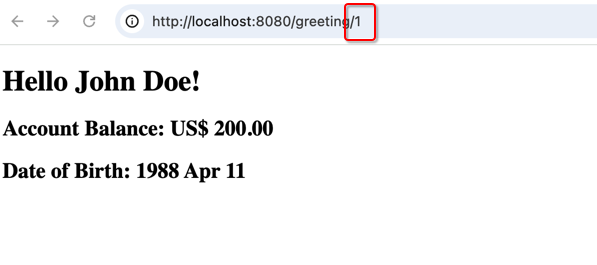
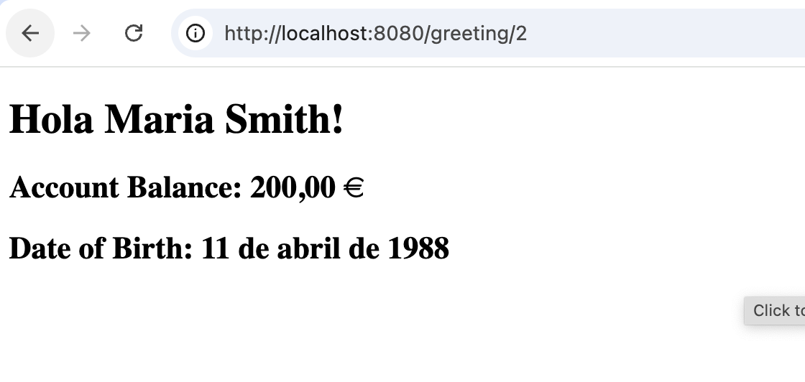
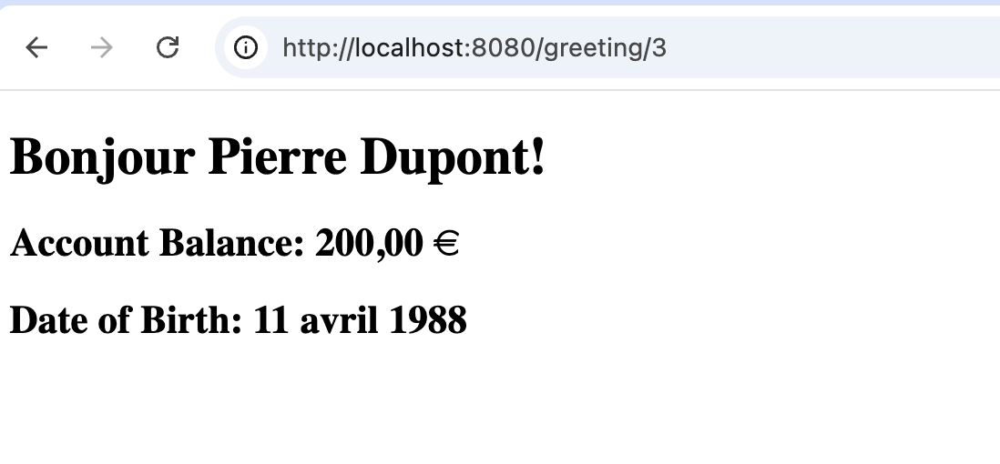

# Spring Boot Internationalization Demo

This is a Spring Boot application that demonstrates the use of Internationalization (i18n) with three languages: English (`en`), Spanish (`es`), and French (`fr`). The application uses an H2 in-memory database to store user information, which includes a preferred language setting. Depending on the user's language preference, a localized greeting message is displayed using Apache FreeMarker.

## Features

- **Internationalization (i18n)**: The app supports dynamic language switching based on user preferences (`en`, `es`, `fr`).
- **H2 In-Memory Database**: Stores sample user data with language preferences.
- **Path Parameter Support**: Retrieve user details by ID from the path parameter.
- **FreeMarker Templates**: Render the view with a localized greeting message and the user's name.
- **Gradle**: The project uses Gradle as the build tool.

## Requirements

- Java 20+
- Gradle 7.0+

## Setup Instructions

### 1. Clone the repository

```bash
git clone https://github.com/your-username/spring-i18n-demo.git
cd spring-i18n-demo
```

### 2. Build the project using Gradle

```bash
./gradlew build
```

### 3. Run the application

```bash
./gradlew bootRun
```

The application will start on `http://localhost:8080`.

### 4. Access the Application

You can access the greeting page by providing a user ID in the URL. For example:

- [http://localhost:8080/greeting/1](http://localhost:8080/greeting/1) - Returns a greeting for user 1 (English)


- [http://localhost:8080/greeting/2](http://localhost:8080/greeting/2) - Returns a greeting for user 2 (Spanish)

- [http://localhost:8080/greeting/3](http://localhost:8080/greeting/3) - Returns a greeting for user 3 (French)


### Running Tests

You can run the tests using the following command:

```bash
./gradlew test
```

## Conclusion

This Spring Boot application demonstrates how to use Internationalization (i18n) with different language preferences. It also illustrates how to render localized messages in FreeMarker templates and store user preferences in a database. The application supports three languages: English, Spanish, and French.

---

This `README.md` file provides a concise but complete overview of your Spring Boot i18n project, including setup, code structure, and usage instructions.